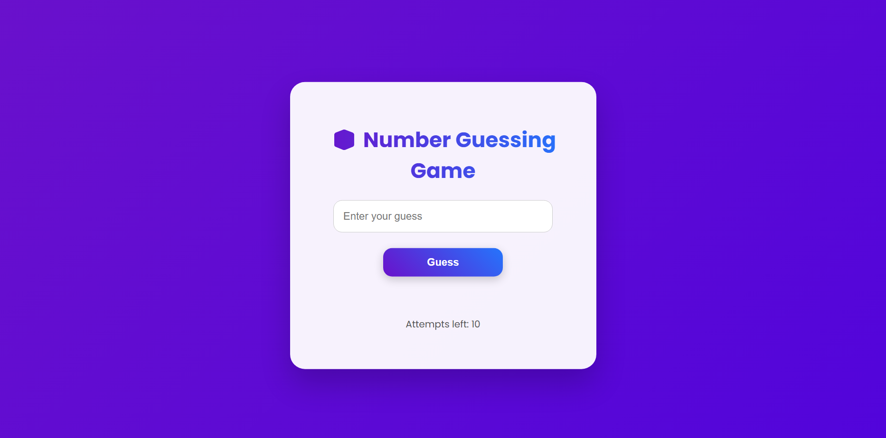

# 🎲 Number Guessing Game 

A modern, interactive **Number Guessing Game** built with **Brython**, HTML, and CSS. Players try to guess a randomly generated number between 1 and 100. The game allows up to 10 attempts, shows helpful feedback, and includes a restart button for multiple rounds.

---

## 💡 Features

- Random number between **1 and 100**
- Maximum **10 attempts**
- Interactive feedback:
  - Too low / Too high
  - Success message with number of attempts
  - Game over message
- **Enter key support** to submit guesses
- Modern **UI design** with gradient backgrounds, card layout, and smooth hover effects
- Responsive layout for desktop and mobile

---

## 🖼️ Screenshot

  

---

## 🚀 Getting Started

### Prerequisites

- A modern web browser (Chrome, Firefox, Edge, Safari)
- Internet connection for Brython CDN

### Installation

1. Clone the repository:

```bash
git clone https://github.com/Dijash/Number-Guessing-Game-Website.git
